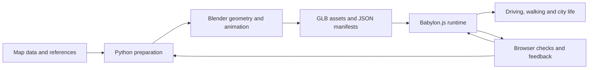

# GTA_SZ · 深城纪

**GPT-6 Astra と Fable 5.1 とともに、ブラウザーで遊べる深圳の街をつくる。**

[English](README.md) · [简体中文](README.zh-CN.md) · **日本語**

**[ブラウザーで試遊 · PC 推奨](https://gtasz.vercel.app/)**

[ソース](https://github.com/linranff/GTA_SZ) · [実装と検証の記録](docs/characters/local-mmd.md)

深圳湾をドライブし、街を歩き、小さな仕事を引き受け、空から街並みを眺める。深城纪（ShenChengJi）は、公開地図データ、Blender のアセット、Babylon.js を組み合わせ、深圳湾・南山・福田・羅湖の一部を凝縮した探索型プロトタイプです。自動車、戦車、徒歩、ドローン、飛行機の各モードと、昼・夕方・夜のライティングがあります。

この README は制作入門も兼ねています。使用した AI モデル、地図からゲームアセットをつくる流れ、車両の消失や反射の遅延、描画の停止をどう調べたかを紹介します。ゲーム内 UI は主に簡体字中国語です。3 言語で提供しているのは文書であり、ゲームの多言語化ではありません。


*上の画像は表現の方向性を示す v0.2 当時のものです。最新の実装は試遊版と対応するコードをご確認ください。*

## AI モデルと開発での分担

| 担当 | このプロジェクトでの主な作業 | 結果の確認方法 |
| --- | --- | --- |
| **GPT-6 Astra** | 都市・ゲーム機能の分解、Blender Python によるモデリングとアセット処理、マテリアル・照明の調整、キャラクター統合、ブラウザー確認 | スクリプト、GLB/JSON の記録、実際の視点と操作を確認。生成画像だけで判断しない |
| **Fable 5.1** | コード変更、性能問題の調査と修正。特に一連の修正では運転・車両切り替え時のシェーダー再コンパイルを扱った | [7ebf1d6](https://github.com/linranff/GTA_SZ/commit/7ebf1d6) と[修正前後の記録](docs/性能修复-2026-09-09-着色器重编译.md)から、長いフレーム、コンパイル回数、描画漏れを確認 |
| **プロジェクト作者** | 舞台・遊びの選定、参考資料の提供、実機の不具合報告、取捨選択、バージョン統合 | 運転・徒歩・建物の観察・モード切り替えを繰り返し、報告した問題が解決したか確認 |

モデル名は作者が確認した使用記録に基づきます。これは本プロジェクトでの分担であり、モデルの性能ランキングではありません。AI は開発工程で使用しており、プレイに大規模言語モデルの API キーは不要です。毎フレームモデルへ問い合わせるゲームでもありません。

基本の流れは、**問題を一つ定める → 担当コードを探す → 実装を生成・変更する → ゲームで再現確認する → 記録を残してコミットする**、です。独立した建物やアセットは分担できますが、共通の描画コード、マニフェスト、最終アセットの統合は一人が担当し、上書きを避けます。

タスクの書き方の例：

```text
目標：カメラを素早く回したとき、水面の反射が建物より遅れる問題を直す。
先に読む：src/city-world.ts、src/city-bay-water.ts、既存の反射検証記録。
維持する：都市、海岸、マテリアル、静止時の更新頻度削減。
成果物：原因に対応した変更、同じ視点での確認、残っている制限。
確認操作：左右へ素早く回す、静止する、昼・夕方・夜で繰り返す。
```

「見た目がおかしい」を、再現できる操作と確認範囲に変えることが重要です。モデルの読み込み成功、ビルド成功、一枚の見栄えのよい画像だけでは、機能全体の完成は確認できません。

## 技術スタック

| 技術 | 役割 | 読み始める場所 |
| --- | --- | --- |
| **Babylon.js 8.56.2 / WebGL2** | ブラウザー内のリアルタイム描画、PBR、照明、鏡面、骨格、カメラ | [city-world.ts](src/city-world.ts) |
| **TypeScript 5.9.3 + Vite 7.3.6** | ゲーム状態、UI、モジュール、開発・本番ビルド | [main.ts](src/main.ts)、[package.json](package.json) |
| **Blender + Python** | 建物・車両・植生の加工、キャラクターのリグとアニメーションのベイク | [city_mesh.py](scripts/city_mesh.py)、[character_gait.py](scripts/character_gait.py) |
| **OpenStreetMap、Copernicus など** | 道路、建物の輪郭、地形入力、出所の記録 | [データ帰属](data/ATTRIBUTION.md)、[建物の納品記録](docs/landmarks/delivery.md) |
| **GLB / glTF Transform / meshoptimizer** | アセット交換、形状処理、最適化。JSON には位置・パラメーター・ハッシュを保存 | [アセット構築手順](docs/资产重建与交付保护.md) |
| **Git LFS + Node テスト + Playwright** | 大容量ファイルの管理、ルール検証、実ブラウザーでの操作確認 | [.gitattributes](.gitattributes)、[tests](tests)、[scripts](scripts) |

バージョンは現在の `package-lock.json` に基づきます。再現時は依存関係を一括更新せず、まず `npm ci` を使ってください。Blender はオフライン制作に使い、プレイヤーが見る画面は Babylon.js がリアルタイムに描画します。

## データから遊べる都市まで



**1. 位置を決め、推定値を区別する。** 地図の輪郭だけでは建物の外観は完成しません。写真なども参照し、実測値、資料の記載値、表現上の推定を分けて記録します。ゲームの局所原点は `[114.025, 22.536]`、統一縮尺は `0.60` です。座標とルート変換は [AGENTS.md](AGENTS.md) に従い、初期調査で使った別の座標系をそのまま混ぜないでください。

**2. 都市全体ではなく、追加部分を更新する。** 基本都市は `public/city/city.json`、重点建物は `landmark-detail.json` / `landmark-detail.glb` で統合します。`baseBuildingIds` と除外マニフェストで既存建物の重複を取り除きます。[build_landmark_details.py](scripts/build_landmark_details.py) と [scripts/landmarks](scripts/landmarks) を読んでから、一つの対象を変更してください。遊ぶだけ、またはブラウザー側のロジックを編集するだけなら、アセットの再構築は不要です。

**3. マテリアルは実行環境で確認する。** ガラスや車体塗装には、基本色の明るさだけでなく環境照明と反射が必要です。発光する窓は自発光・露出・後処理にも関係します。道路の水たまりと湾の水面は、別々の鏡面とマテリアルで制御します。同じ視点を昼・夕方・夜で比較し、別の露出で問題を隠さないようにします。

**4. 動作とコントローラーを一緒に統合する。** PMX を Blender で変換し骨格を調整した後、待機・歩行・走行・手振りを GLB にベイクします。歩行はオフラインの二骨 IK で生成し、実行時には移動速度に合わせてアニメーション時間を調整します。乗り降り、地面の高さ、カメラと壁の関係も確認対象です。テクスチャ、身長、腕と膝は動かして観察します。[キャラクター記録](docs/characters/local-mmd.md)にあるとおり、髪・衣服の物理や実行時の足ごとの地形 IK は未実装です。

## 性能最適化：実際の問題と取捨選択

### 事例：車両や街が一瞬消える原因

`3104cdf` の調査では、車両切り替え、近くの照明変化、非同期 GLB 読み込みが、既存マテリアルの照明構成を変えていました。多数の PBR シェーダーが再コンパイルされ、準備が間に合わないサブメッシュが描画されず、隙間に空が見えていました。

修正では車両灯を独立した常時有効のノードへ移し、局所照明の構成を固定して、明滅は強度で表現しました。GLB の読み込み時には既存マテリアルのライト数予算を維持し、MSAA/FXAA の変更はまとめて適用して、都市全体のマテリアルを不要に無効化しないようにしています。

| 過去の A/B 検証項目 | 基準 `3104cdf` | 修正記録 |
| --- | ---: | ---: |
| 80 ms を超えるフレーム間隔 | 31 回 | 3 回 |
| Long tasks | 49 | 12 |
| 検証全体のシェーダーコンパイル回数 | 650 | 198 |
| 戦車モードを終了 | 約 1066 / 1074 ms の 2 フレーム | 80 ms 超なし、コンパイル 0 回 |

同じ操作列、1920×1080、Chrome / Metal で行った過去の測定です。**現在の全機能・都市全域の性能保証ではありません。** この密集した経路の定常 FPS は約 54～55 のままで、改善したのは切り替え時の停止と描画漏れです。初回のアセット解析による停止は残ります。方法、例外、制限は[詳細記録](docs/性能修复-2026-09-09-着色器重编译.md)を参照してください。

[city-gltf-streaming.ts](src/city-gltf-streaming.ts) と [city-cinematic.ts](src/city-cinematic.ts) の一部は、現在の Babylon の内部動作に依存します。エンジン更新時には再検証が必要で、どのプロジェクトにもそのまま使える修正ではありません。

### ほかに参考になる工夫

| 問題 | 現在の対処 | コスト・制限 |
| --- | --- | --- |
| 詳細な外壁を全部読み込むと重い | 640 m 単位のタイル。中心から約 1050 m で先読み、700 m で表示、1500 m を超えると解放。読み込みは逐次処理 | 基本都市は一括読み込み。遠景では近距離の細部を省く。[コード](src/city-facade-stream.ts) |
| 植生の同じ形状が大量にある | 原型と thin instances を使用。移動量がしきい値を超えたときにバッファーを更新し、近景の細部に予算を設定 | インスタンスでも三角形数と半透明の葉の重ね描画にはコストがある。[コード](src/city-landscape.ts) |
| 素早いカメラ移動で反射が遅れる | 移動中は毎フレーム更新。静止後は道路を 2、水面を 3 フレームごとの更新に戻す | 512×512 の平面反射。高頻度更新には追加描画コストがある。[コード](src/city-world.ts) |
| 遠い水面に円弧状の境界が出る | 反射用クリップ面が空を誤って切る処理を修正 | 新しい高コストの反射パスを追加せず、描画の正しさを修正。[記録](docs/graphics/sea-reflection-continuity-2026-09-07.md) |
| ミサイル・爆発の繰り返し生成 | あらかじめ作ったプールを再利用し、数と寿命を制限 | 飛行機のミサイルは最大 6 発、命中爆発は 2 組。[記録](docs/graphics/flight-missiles-2026-09-10.md) |
| 地上と上空で必要な描画予算が異なる | 視距離、影、SSAO を調整。細部の中心は実際の観察対象に追従 | 切り替え時もシェーダーの再生成と描画漏れを確認する。[コード](src/city-world.ts) |
| 開発環境の CPU 負荷 | Vite のポーリングと HMR を無効化し、大きなアセット・出力を監視から除外 | 編集後は手動で再読み込み。[設定](vite.config.ts) |

調査は、**再現 → 同じ場面でフレーム時間・コンパイル・リソース変化を観察 → 仮説を一つずつ検証 → 遊びと見た目を再確認**、の順が役立ちます。平均 FPS だけではすべての停止を説明できません。CPU の描画送信と GPU の処理時間には重なりがあり、単純に合計してもフレーム時間にはなりません。診断の入口は `window.__SHENCHENGJI_CITY__.world.diagnostics()`、検証スクリプトは `scripts/` にあります。

## 起動と本番ビルド

Node.js 24、npm、Git LFS、WebGL2 対応のデスクトップブラウザーが必要です。現在の主な実機確認には macOS Chrome を使用しています。

```sh
git lfs install
git clone --branch main https://github.com/linranff/GTA_SZ.git
cd GTA_SZ
git lfs pull
npm ci
npm run dev
```

Vite の表示する URL、通常は `http://127.0.0.1:5173/` を開いてください。非公開の間はリポジトリのアクセス権が必要です。LFS ポインターだけで実ファイルがない場合、正常に動作しません。

```sh
npm run build
npm run preview -- --port 4173
```

通常のビルドで `public/` を `dist/` へコピーし、`public/characters/` のキャラクターも含めます。`prebuild` がサイズ、ハッシュ、GLB 形式、歩行パラメーターを確認します。`build:characters` は同じビルドの別名です。CI でも Git LFS の取得が必要です。元の PMX、ローカルの Blender プロジェクト、大規模言語モデルの API キーは不要です。

## 操作一覧

| モード・入力 | 操作 |
| --- | --- |
| 自動車：WASD / 矢印キー、Space | 運転、ハンドブレーキ |
| F / T | 停止した近くの車両に乗り降り。運転中に自動車と戦車を切り替え |
| 徒歩：WASD、Shift、C | 歩行、走行、一人称・三人称 |
| G / B | ドローン観察。ドローンと飛行機の切り替え |
| ドローン：WASD / 矢印キー、Q/E | 平行移動 / 見回し、下降 / 上昇 |
| ドラッグ、Shift + ドラッグ、ホイール | 観察視点での旋回、平行移動、ズーム |
| 戦車：Q/E、PageUp/PageDown、Space、X | 砲塔、砲身、射撃、ブレーキ |
| 飛行機：Space、X | ミサイル、減速。照準 UI は表示しない |
| M / L / J | 地図、ライティング、シティジャーナル |
| P | フレームレート情報 |

詳細は[戦車・徒歩の記録](docs/graphics/tank-rider-rendering-2026-09-09.md)、[飛行機のミサイル](docs/graphics/flight-missiles-2026-09-10.md)へ。弾の命中と爆発表現はありますが、建物の構造を破壊する完全なシステムはありません。

## 学ぶ・変更する・確認する

`src/main.ts` → `src/city-world.ts` → 関心のあるサブシステム、続いてそのスクリプト、テスト、記録を読む順がおすすめです。最初の変更には、地名、仕事の文章、再現できるカメラ問題、一つのマテリアル設定などが向いています。

```sh
npm test
npm run build
node scripts/check-character-assets.mjs
# 5173 で開発サーバーを起動してから：
node scripts/check-local-characters.mjs
node scripts/check-character-surfaces.mjs
# 4174 で本番プレビューを起動してから：
node scripts/check-character-deployment.mjs
```

直近の機能検証記録（2026-09-10）：自動テスト 218 件、キャラクターのブラウザー検証 18 件、地面・カメラ検証 4 件、通常の本番ビルドでのキャラクター配布検証 5 件が通過しています。これは完了した検証の記録であり、README 更新に合わせて性能を再測定したものではありません。ブラウザースクリプトには現在 macOS Chrome のパスが含まれるため、他の環境では調整してください。`output/` と `artifacts/` の出力は Git 管理対象外です。

全アセットの再構築は `npm run build` とは別です。先に[アセット手順](docs/资产重建与交付保护.md)を読み、`npm run assets -- --plan` で工程と不足入力を確認してください。元データからの全工程は、まだ通しで検証できていません。[city_mesh.py](scripts/city_mesh.py) はインポート時に Blender のシーンを初期化するため、通常の Python データ確認で安易にインポートしないでください。

## データ・モデル・ライセンス

本作は現在、非商用ゲームのプロトタイプです。**公開して読めることと、全ファイルに共通のオープンソースライセンスがあることは同じではありません。** コード、地理データ、第三者アセットは別々の条件に従い、プロジェクトの宣言で他者の条件を置き換えることはできません。

- 道路・建物の輪郭：© OpenStreetMap contributors、ODbL。[データ帰属](data/ATTRIBUTION.md)。
- プレイヤー車両：Khronos CarConcept、DGG / Eric Chadwick、CC BY 4.0。[車両クレジット](public/licenses/carconcept-CC-BY-4.0.md)。
- 一部の空・樹木・ベンチ：Poly Haven / OpenGameArt。[アセット一覧](public/licenses/open-city-assets.md)、[昼の環境](public/licenses/daylight-environment.md)。
- 地形・建物：[海岸地形](public/licenses/coastal-terrain.md)、[ランドマーク帰属](public/city/LANDMARK_ATTRIBUTION.md)。
- 久岐忍 / 夜蘭：**モデル提供 miHoYo、MMD モデル改造 观海（Guanhai）**。[配布ページ](https://www.bilibili.com/blackboard/activity-FEYTyCHYZo.html) · [久岐忍の原本](https://activity.hdslb.com/blackboard/static/20220525/c84ef0977c17fb1198f6887261fea35f/sWn1QvNF82.zip) · [夜蘭の原本](https://activity.hdslb.com/blackboard/static/20220525/c84ef0977c17fb1198f6887261fea35f/PEhFH0is3N.zip)。本作では形式変換、骨格互換処理、縮尺調整、動作のベイク、マテリアル調整を行っています。原本の条件は商用利用、再配布、他モデルへの部品流用、列挙された不適切な用途を禁止しています。クレジットや非商用であることは追加の許可を意味しません。本作は原条件を超える許可を取得したとは主張せず、miHoYo / HoYoverse との提携・公式関係もありません。[出所とハッシュ](public/characters/manifest.json)。
- その他のアセット・依存関係：[public/licenses](public/licenses) の表記を維持してください。ユーザー提供や AI 加工というだけで、自由な再配布が許可されるわけではありません。

街は凝縮され、建物の高さ・外観・地形にはゲーム用の改変があります。深圳全域の測量精度のデジタルツインではありません。本格的な公開・配布には、コードのライセンスと各アセットの配布範囲を別途定める必要があります。
