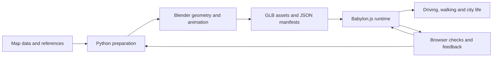

# GTA_SZ · 深城纪

**Building a playable Shenzhen in the browser with GPT-6 Astra and Fable 5.1.**

**English** · [简体中文](README.zh-CN.md) · [日本語](README.ja.md)

**[Play in the browser · desktop recommended](https://gtasz.vercel.app/)** · [Source](https://github.com/linranff/GTA_SZ) · [Landmark workflow](docs/landmarks/agent-workflow.md) · [Character notes](docs/characters/local-mmd.md)


*Sunset orbit around Spring Bamboo and Talent Park, captured in-engine from the current assets on 2026-09-17. [1080p clip](docs/media/readme/spring-bamboo-sunset.mp4)*

Drive along Shenzhen Bay, walk through a neighborhood, take a small job, or fly above the skyline. ShenChengJi combines open map data, Blender assets and Babylon.js into a compressed, explorable interpretation of parts of Shenzhen Bay, Nanshan, Futian and Luohu. The prototype includes cars, a tank, walking, drone and aircraft modes, with daylight, sunset and night lighting.

The playable game is the Babylon.js browser build. An Unreal Engine 5 port lives under [`ue5/`](ue5/README.md) as an experiment and is not the primary client.

This README is also a learning guide: which AI models participated, how map data becomes game assets, and how disappearing vehicles, delayed reflections and rendering stalls were investigated. The game UI is primarily Simplified Chinese; the three language editions cover documentation, not in-game localization.

## In the city

Six-second loops shot with the project's own director pipeline (`trailer.html?reel=readme`), no post-production. Click a still for the 720p clip.

<table>
  <tr>
    <td width="33%"><a href="docs/media/readme/futian-axis-day.mp4"></a><br><sub><b>Futian axis · day</b> — Ping An Finance Centre, Civic Center, Lianhua Hill</sub></td>
    <td width="33%"><a href="docs/media/readme/luohu-night.mp4"></a><br><sub><b>Luohu · night</b> — KK100, Diwang Building, Guomao</sub></td>
    <td width="33%"><a href="docs/media/readme/tencent-binhai-day.mp4"></a><br><sub><b>Nanshan · day</b> — Tencent Seafront Towers, Houhai, the bay</sub></td>
  </tr>
  <tr>
    <td width="33%"><a href="docs/media/readme/lianhua-hill-sunset.mp4"></a><br><sub><b>Lianhua Hill · sunset</b> — Copernicus 30 m terrain under the CBD</sub></td>
    <td width="33%"><a href="docs/media/readme/binhai-night-drive.mp4"></a><br><sub><b>Binhai Boulevard · night drive</b> — staged replay on the real road graph</sub></td>
    <td width="33%"><br><sub><b>Street level · sunset</b> — walking mode, live gameplay screenshot</sub></td>
  </tr>
</table>

The media above use the current assets: 37 landmark candidates from the Blender modules under [scripts/landmarks](scripts/landmarks) are merged into [`landmark-candidates.glb`](public/city/landmark-candidates.json), including KK100, Diwang, Guomao, SEG Plaza and the Shenzhen Stock Exchange; seven more (Spring Bamboo, Tencent, Civic Center, Lianhua Hill, MixC World, Fortune Plaza, Qijie Mansion) keep their earlier detailed builds, and six fall outside the game bounds. The base OSM blocks under each landmark are cut out of `buildings.glb` and the facade tiles so nothing overlaps. Regenerate with `node scripts/record-trailer.mjs --reel=readme` followed by `scripts/encode-readme-media.sh`.

## AI models and the development workflow

| Contributor | Main work in this project | How the result is checked |
| --- | --- | --- |
| **GPT-6 Astra** | Breaking down city and gameplay work, Blender Python modeling and asset processing, material and lighting iteration, character integration, browser checks | Inspect scripts, GLB/JSON manifests, actual viewpoints and interactions; evaluate the running game rather than generated images alone |
| **Fable 5.1** | Code changes, performance investigation and fixes; one focused pass addressed shader recompilation during driving and vehicle switches | Inspect [7ebf1d6](https://github.com/linranff/GTA_SZ/commit/7ebf1d6) and the [before/after record](docs/性能修复-2026-09-09-着色器重编译.md): long frames, compilation counts and skipped draws |
| **Project author** | Choosing the setting and mechanics, supplying references, reporting gameplay issues, making tradeoffs and integrating versions | Drive, walk, inspect landmarks and switch modes to check that changes solve the reported problem |

Model names follow the project author's confirmed usage records. These are project responsibilities, not a model ranking. AI is part of the development workflow: playing the game requires no language-model API key, and gameplay does not depend on per-frame model requests.

The loop is: **define one issue → locate the responsible code → generate or modify the implementation → reproduce it in the game → keep evidence and commit**. Independent landmarks or assets can be developed separately; shared rendering code, manifests and final assets have one integration owner to avoid overwrites.

An example task brief:

```text
Goal: fix water reflections lagging behind buildings during fast camera turns.
Read: src/city-world.ts, src/city-bay-water.ts and existing reflection notes.
Preserve: the city, coast, materials and reduced refresh rate when stationary.
Deliver: a cause-specific change, a same-viewpoint check and remaining limitations.
Check: fast left/right turns; hold still; repeat in day, sunset and night modes.
```

Turn “this looks wrong” into a reproducible action and a defined inspection area. A model loading successfully, a passing build or one attractive screenshot does not establish that the whole feature works.

## Technology stack

| Technology | Responsibility | Starting point |
| --- | --- | --- |
| **Babylon.js 8.56.2 / WebGL2** | Real-time browser scene, PBR materials, lights, mirrors, skeletons and cameras | [city-world.ts](src/city-world.ts) |
| **TypeScript 5.9.3 + Vite 7.3.6** | Gameplay state, UI, modules, development and production builds | [main.ts](src/main.ts), [package.json](package.json) |
| **Blender + Python** | Landmark, vehicle and vegetation processing; character rigs and baked animation | [city_mesh.py](scripts/city_mesh.py), [character_gait.py](scripts/character_gait.py) |
| **OpenStreetMap, Copernicus and other inputs** | Roads, footprints, terrain and provenance | [Data attribution](data/ATTRIBUTION.md), [landmark delivery](docs/landmarks/delivery.md) |
| **GLB / glTF Transform / meshoptimizer** | Asset interchange, geometry processing and optimization; JSON stores positions, parameters and hashes | [Asset build workflow](docs/资产重建与交付保护.md) |
| **Git LFS + Node tests + Playwright** | Large-file versioning, rule checks and real browser interaction | [.gitattributes](.gitattributes), [tests](tests), [scripts](scripts) |

Versions come from the current `package-lock.json`. Start with `npm ci` rather than upgrading every dependency. Blender is an offline authoring tool; Babylon.js renders the player's real-time view.

## From data to a playable city



**1. Establish positions and label estimates.** A map footprint is not a finished facade. Landmarks need photographs and other references; measured values, source claims and artistic estimates are recorded separately. The game uses local origin `[114.025, 22.536]` and a uniform `0.60` scale. Follow [AGENTS.md](AGENTS.md) for coordinate and root-transform conventions; do not mix early research coordinates into the runtime scene.

**2. Add detail incrementally.** The base city is `public/city/city.json`; selected landmarks are integrated through `landmark-detail.json` and `landmark-detail.glb`. `baseBuildingIds` and exclusion manifests remove duplicate base buildings. Read [build_landmark_details.py](scripts/build_landmark_details.py) and [scripts/landmarks](scripts/landmarks), then change one object. Playing the game or editing browser logic does not require rebuilding these assets.

**3. Check materials in the runtime.** Glass and car paint need suitable environment lighting and reflections, not just brighter base colors. Lit windows also depend on emission, exposure and post-processing. Road puddles and the bay have separate mirror and material controls. Compare the same viewpoint in daylight, sunset and night instead of masking an issue with another lighting preset.

**4. Integrate animation with the controller.** PMX models are converted and their skeletons adapted in Blender, then idle, walk, run or wave clips are baked into GLB. Locomotion uses offline two-bone IK, with runtime animation timing matched to movement speed. Vehicle entry/exit, surface height and camera obstruction are part of the same integration. Inspect textures, scale, arms and knees in motion. [Character notes](docs/characters/local-mmd.md) cover current limits: no hair/cloth physics or runtime per-foot terrain IK.

## Performance: problems, fixes and tradeoffs

### Case study: why did vehicles and city meshes disappear?

An investigation of `3104cdf` found that vehicle switches, local lighting changes and asynchronous GLB loads changed the light configuration of existing materials. Many PBR shaders recompiled; submeshes whose materials were not ready were skipped, revealing sky through the gaps.

The fix kept the vehicle lights on an independent, continuously enabled rig, retained stable local-light configurations and used intensity for on/off appearance. GLB loading preserves existing material light budgets. MSAA/FXAA changes are applied together to avoid unnecessary invalidation of materials across the city.

| Historical A/B check | Baseline `3104cdf` | Recorded fix |
| --- | ---: | ---: |
| Frame intervals above 80 ms | 31 | 3 |
| Long tasks | 49 | 12 |
| Shader compilations over the sequence | 650 | 198 |
| Leaving tank mode | Two frames around 1066 / 1074 ms | No frame above 80 ms; 0 compilations |

These are historical measurements using the same scripted sequence at 1920×1080 in Chrome / Metal, **not a city-wide performance promise for every current feature**. Steady-state performance in that dense route remained about 54–55 FPS; the improvement was fewer transition stalls and skipped draws. First-time asset parsing can still stall. The [full record](docs/性能修复-2026-09-09-着色器重编译.md) includes the method, exceptions and limitations.

Parts of the guards in [city-gltf-streaming.ts](src/city-gltf-streaming.ts) and [city-cinematic.ts](src/city-cinematic.ts) depend on the current Babylon version's internals. Revalidate them when upgrading the engine; they are not universal patches to copy into every project.

### Other techniques worth studying

| Problem | Current approach | Cost or limitation |
| --- | --- | --- |
| Loading all detailed facades at once | 640 m tiles; prefetch within roughly 1050 m of a tile center, display within 700 m, unload beyond 1500 m; sequential loading queue | The base city still loads as a whole; distant views omit nearby detail. [Code](src/city-facade-stream.ts) |
| Repeated vegetation geometry | Prototypes + thin instances; rebuild instance buffers after a movement threshold; budget nearby detail | Instances still cost triangles and transparent leaf overdraw. [Code](src/city-landscape.ts) |
| Reflections lag during fast camera movement | Refresh mirrors every frame while moving, then every 2/3 frames for road/water when stationary | Uses 512×512 planar targets; frequent refresh still costs extra rendering. [Code](src/city-world.ts) |
| An arc-shaped break across distant water | Correct sky clipping against the water reflection plane | A correctness fix without adding another expensive reflection pass. [Record](docs/graphics/sea-reflection-continuity-2026-09-07.md) |
| Repeated missile/explosion allocations | Pre-create and reuse pools, with bounded counts and lifetimes | Currently up to 6 aircraft missiles and 2 missile-impact explosion groups. [Record](docs/graphics/flight-missiles-2026-09-10.md) |
| Street and aerial views need different budgets | Adjust view distance, shadows and SSAO; detail follows the actual observation focus | Transitions themselves need shader-variant and missing-draw checks. [Code](src/city-world.ts) |
| Development tooling consumes CPU | Disable Vite polling and HMR; exclude large asset/output directories, GLB/HDR binaries and editor temp dirs from the watcher | Refresh manually after edits; dropping a GLB into `public/` no longer kills the dev server. [Config](vite.config.ts) |

A useful investigation order: **reproduce → inspect frame times, compilations and resources in the same scene → test one hypothesis → recheck gameplay and visuals**. Average FPS does not explain every hitch. CPU submission and GPU time overlap, so adding them does not give total frame time. Start with `window.__SHENCHENGJI_CITY__.world.diagnostics()` and the checks under `scripts/`.

## Run and build

Use Node.js 24, npm, Git LFS and a desktop browser with WebGL2. Most current visual checks use Chrome on macOS.

```sh
git lfs install
git clone --branch main https://github.com/linranff/GTA_SZ.git
cd GTA_SZ
git lfs pull
npm ci
npm run dev
```

Open the Vite URL, usually `http://127.0.0.1:5173/`. Access is required while the repository is private. LFS pointers without their binary contents are not a runnable asset checkout.

```sh
npm run build
npm run preview -- --port 4173
```

The public demo is served by Vercel today; a Cloudflare Workers + R2 deployment (large GLB/HDR files from R2 with Brotli, ETag revalidation and Range support) is documented in [cloudflare/README.md](cloudflare/README.md) and runs at `shenchengji.gtasz.workers.dev`.

The standard build copies `public/` assets into `dist/`, including runtime characters in `public/characters/`. `prebuild` checks their size, hashes, GLB format and gait parameters; `build:characters` remains an alias for the same build. CI must fetch Git LFS files too. Original PMX files, local Blender projects and language-model API keys are not required.

## Controls at a glance


| Mode / input | Action |
| --- | --- |
| Car: WASD / arrows, Space | Drive, handbrake |
| F / T | Enter/exit a stopped nearby vehicle; switch car/tank while driving |
| Walking: WASD, Shift, C | Walk, run, first/third person |
| G / B | Drone observation; switch between drone and aircraft |
| Drone: WASD / arrows, Q/E | Translate / look, descend / ascend |
| Drag, Shift + drag, wheel | Orbit, pan, zoom in observation mode |
| Tank: Q/E, PageUp/PageDown, Space, X | Turret, barrel, fire, brake |
| Aircraft: Space, X | Missiles, slow down; no aiming reticle |
| M / L / J | Map, lighting preset, city journal |
| P | Frame-rate information |

See [tank/walking notes](docs/graphics/tank-rider-rendering-2026-09-09.md) and [aircraft missiles](docs/graphics/flight-missiles-2026-09-10.md) for details. Projectile impacts and explosions exist; a complete structural building-destruction system does not.

## Learn, change, verify

Suggested reading order: `src/main.ts` → `src/city-world.ts` → a subsystem that interests you, then its scripts, tests and records. Place names, mission text, reproducible camera issues or one material parameter are good first changes.

```sh
npm test
npm run build
node scripts/check-character-assets.mjs
# With development running on 5173:
node scripts/check-local-characters.mjs
node scripts/check-character-surfaces.mjs
# With production preview running on 4174:
node scripts/check-character-deployment.mjs
```

Latest recorded functional checks (2026-09-17): 257 automated tests passed and `npm run build` succeeded on the current assets. Earlier records (2026-09-10): character integration had 18 browser checks and 4 surface/camera checks; the standard production build had 5 additional character-deployment checks. These are completed check records, not a fresh performance benchmark conducted for this README. Browser scripts currently include a macOS Chrome path; adapt it for other systems. Outputs under `output/` and `artifacts/` are ignored by Git.

A full asset rebuild is different from `npm run build`. Read the [asset workflow](docs/资产重建与交付保护.md) first; `npm run assets -- --plan` lists stages and missing inputs. The complete source-data rebuild has not been verified end to end. Importing [city_mesh.py](scripts/city_mesh.py) initializes a Blender scene, so do not import it for ordinary Python data inspection.

## Data, models and licensing

**Code is MIT-licensed** ([LICENSE](LICENSE)): everything under `src/`, `scripts/`, `tests/`, `cloudflare/`, `ue5/Shenchengji/Source/` and the build configuration. Pull requests are welcome; by contributing code you agree it is released under the same MIT terms. **The license covers code only.** Game assets under `public/`, source data under `data/`, media under `docs/media/` and the character models keep their own terms listed below; do not add an asset to a PR without a matching notice in [public/licenses](public/licenses) or [data/ATTRIBUTION.md](data/ATTRIBUTION.md).

This is currently a noncommercial game prototype. **Publicly readable files do not automatically share one open-source license.** Code, geographic data and third-party assets have separate terms; a project notice cannot replace another rights holder's license.

- Roads and footprints: © OpenStreetMap contributors, ODbL; see [data attribution](data/ATTRIBUTION.md).
- Hero vehicle: Khronos CarConcept, DGG / Eric Chadwick, CC BY 4.0; see [vehicle credits](public/licenses/carconcept-CC-BY-4.0.md).
- Selected skies, trees and seating: Poly Haven / OpenGameArt; see [asset credits](public/licenses/open-city-assets.md) and [daylight environment](public/licenses/daylight-environment.md).
- Terrain and landmarks: [coastal terrain](public/licenses/coastal-terrain.md), [landmark attribution](public/city/LANDMARK_ATTRIBUTION.md).
- Kuki Shinobu / Yelan: **models provided by miHoYo; MMD adaptation by 观海 (Guanhai).** [Distribution page](https://www.bilibili.com/blackboard/activity-FEYTyCHYZo.html) · [Original Kuki archive](https://activity.hdslb.com/blackboard/static/20220525/c84ef0977c17fb1198f6887261fea35f/sWn1QvNF82.zip) · [Original Yelan archive](https://activity.hdslb.com/blackboard/static/20220525/c84ef0977c17fb1198f6887261fea35f/PEhFH0is3N.zip). Project changes include format conversion, skeleton compatibility, scaling, animation baking and material adaptation. Original terms prohibit commercial use, redistribution, extracting parts for other models and listed inappropriate uses. Attribution and noncommercial use grant no additional permission. The project does not claim permission beyond those terms and is not affiliated with or endorsed by miHoYo / HoYoverse. [Provenance and hashes](public/characters/manifest.json).
- Other assets and dependencies: retain the notices in [public/licenses](public/licenses). User-supplied or AI-processed assets are not automatically licensed for open redistribution.

The city is compressed, with artistic changes to building heights, facades and terrain. It is not a survey-accurate digital twin of all Shenzhen. The code license is settled (MIT); a full release still requires a separate decision on each asset category's distribution scope.
