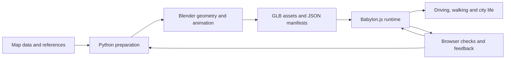

# GTA_SZ · 深城纪

**和 GPT-6 Astra、Fable 5.1 一起，把深圳城市探索原型做进浏览器。**

[English](README.md) · **简体中文** · [日本語](README.ja.md)

**[立即试玩 · 建议使用电脑浏览器](https://gtasz.vercel.app/)**

[项目源码](https://github.com/linranff/GTA_SZ) · [制作与验证记录](docs/characters/local-mmd.md)

在深圳湾开车，走进街区，做一份小工作，或飞到天际线上方。《深城纪》用开放地图数据、Blender 资产和 Babylon.js，把深圳湾、南山、福田和罗湖的部分区域压缩成可探索的城市。已有汽车、坦克、步行、无人机与飞机模式，以及白天、黄昏、夜晚三种光照。

这份 README 同时是一份入门导览：介绍用了哪些 AI 模型，地图如何变成游戏资产，以及车辆消失、反射延迟和卡顿是怎样逐步排查的。游戏 UI 目前主要为简体中文；三个语言版本覆盖文档，不代表游戏已完成多语言适配。


*上图保留自 v0.2 实机，方便了解场景方向；最新实现请以试玩与对应代码为准。*

## 使用的 AI 模型与分工

| 参与者 | 在本项目中的主要工作 | 怎样检查结果 |
| --- | --- | --- |
| **GPT-6 Astra** | 城市与玩法拆解、Blender Python 建模和资产处理、材质与灯光迭代、角色接入、浏览器检查 | 检查脚本、GLB/JSON 清单、实际机位与操作；使用游戏内结果反馈，而不只看生成图片 |
| **Fable 5.1** | 代码修改、性能问题定位与修复；其中一轮重点处理驾驶和载具切换引发的着色器重编译 | 阅读 [7ebf1d6](https://github.com/linranff/GTA_SZ/commit/7ebf1d6) 与[前后对比记录](docs/性能修复-2026-09-09-着色器重编译.md)，核对长帧、编译次数和漏绘 |
| **项目作者** | 选城市与玩法、提供参考、指出实机问题、决定取舍和整合版本 | 持续驾驶、走动、观察地标与切换模式，检查修改是否真正解决问题 |

模型名称按项目作者确认的使用记录标注。这是本项目的工作分配，不是模型能力排行榜。AI 参与开发工具链；运行游戏不需要填写大模型 API Key，当前玩法也不依赖每帧请求大模型。

我们采用的循环是：**明确一项问题 → 定位负责它的文件 → 生成或修改实现 → 实机复现 → 保留证据并提交**。独立地标或资产可以拆开制作；共享渲染文件、清单和最终资产由一个集成者处理，减少互相覆盖。

可以参考这样一份任务描述：

```text
目标：修复快速转动镜头时，海面倒影落后于建筑的问题。
先读：src/city-world.ts、src/city-bay-water.ts 和已有反射记录。
保留：当前城市、海岸、材质，以及静止画面的降频策略。
交付：针对原因的修改、同一机位的检查、尚未解决的情况。
检查：左右快速转向；停住观察；白天/黄昏/夜间各看一次。
```

关键是把“看起来不对”转成可复现的动作和检查范围。不要仅凭一次模型加载成功、构建通过或一张漂亮截图判断整个功能完成。

## 技术栈：各部分负责什么

| 技术 | 用途 | 阅读入口 |
| --- | --- | --- |
| **Babylon.js 8.56.2 / WebGL2** | 浏览器实时场景、PBR 材质、灯光、镜面、骨骼与相机 | [city-world.ts](src/city-world.ts) |
| **TypeScript 5.9.3 + Vite 7.3.6** | 玩法状态、UI、模块组织、开发和发布构建 | [main.ts](src/main.ts)、[package.json](package.json) |
| **Blender + Python** | 地标、车辆和植被加工；角色骨架与动作烘焙 | [city_mesh.py](scripts/city_mesh.py)、[character_gait.py](scripts/character_gait.py) |
| **OpenStreetMap + Copernicus 等数据** | 道路、建筑轮廓、地形输入及来源记录 | [数据说明](data/ATTRIBUTION.md)、[地标交付](docs/landmarks/delivery.md) |
| **GLB / glTF Transform / meshoptimizer** | 资产交换、几何处理和优化；JSON 记录位置、参数与哈希 | [资产构建流程](docs/资产重建与交付保护.md) |
| **Git LFS + Node 测试 + Playwright** | 管理大文件，验证规则与真实浏览器操作 | [.gitattributes](.gitattributes)、[tests](tests)、[scripts](scripts) |

版本来自当前 `package-lock.json`。复现时优先 `npm ci`，不要先升级全部依赖。Blender 用于离线制作；玩家看到的实时画面由 Babylon.js 渲染。

## 从数据到可玩的城市



**1. 用数据确定位置，给估计留下标记。** 地图足印不能自动变成真实立面。地标还需要照片和其他资料核对；实测、来源陈述和艺术估计分别记录。当前游戏使用局部原点 `[114.025, 22.536]` 与统一 `0.60` 缩放，坐标和根节点方向以 [AGENTS.md](AGENTS.md) 为准。早期研究坐标不能直接混入运行场景。

**2. 增量制作，避免改一个地标重建整座城。** 基础城市为 `public/city/city.json`，重点地标在 `landmark-detail.json` / `landmark-detail.glb` 中合并接入。`baseBuildingIds` 与排除清单用于移除重复基础楼体。先读 [build_landmark_details.py](scripts/build_landmark_details.py) 和 [scripts/landmarks](scripts/landmarks)，再选一个对象修改。只想玩或改网页逻辑，不需要重新运行这些构建器。

**3. 材质效果要在运行时检查。** 玻璃和车漆需要合适的环境照明与反射，不能仅靠调亮底色；发光窗户还涉及自发光、曝光和后处理。地面水洼与海面使用不同的镜面与材质控制。白天、黄昏、夜间应在同一机位比较，避免用另一时段的曝光掩盖问题。

**4. 角色动作要与控制器一起接入。** PMX 模型先在 Blender 中转换和适配骨架，再烘焙待机、行走、跑步或招手到 GLB。当前使用离线双骨 IK 生成步态，运行时按位移速度调整动画时钟，并处理上下车、地面高度与相机避墙。贴图、身高、手臂姿态与膝盖都需要实际看。[角色接入说明](docs/characters/local-mmd.md)记录了限制：尚无头发/衣服物理和运行时逐脚地形 IK。

## 性能优化：真实问题与取舍

### 案例：为什么车和城市会突然消失？

在 `3104cdf` 的一次排查中，切换载具、附近灯光变化和异步 GLB 加载会改变已有材质的灯光配置。大量 PBR 着色器重新编译，尚未准备好的子网格被跳过，天空从缺口透出来。

修复不是简单减少楼栋：车辆灯具改挂到独立、持续启用的节点；局部灯光保持固定配置，用强度表示亮灭；GLB 加载保护已有材质的灯光预算；MSAA/FXAA 合并重建，避免不必要的全城材质失效。

| 历史 A/B 检查项目 | 基线 `3104cdf` | 修复记录 |
| --- | ---: | ---: |
| 超过 80 ms 的帧间隔 | 31 次 | 3 次 |
| Long tasks | 49 | 12 |
| 全程着色器编译次数 | 650 | 198 |
| 关闭坦克模式 | 两帧约 1066 / 1074 ms | 无超过 80 ms 的帧，编译 0 次 |

这是同一脚本序列、1920×1080、Chrome / Metal 的历史测量，**不是当前所有功能的全城性能承诺**。该次密集路段稳态仍约 54–55 FPS；改善的是切换时的停顿和漏绘。首次资产解析仍可能停顿。完整方法、例外和限制见[修复记录](docs/性能修复-2026-09-09-着色器重编译.md)。

[city-gltf-streaming.ts](src/city-gltf-streaming.ts) 与 [city-cinematic.ts](src/city-cinematic.ts) 的部分保护依赖 Babylon 当前版本的内部行为；升级引擎时需重新验证，不能当成适用于所有项目的通用补丁。

### 其他值得复用的思路

| 问题 | 当前处理 | 成本或限制 |
| --- | --- | --- |
| 精细立面全部加载太重 | 640 米分块；距块中心约 1050 米预取、700 米显示、1500 米卸载；加载队列串行处理 | 基础城市仍整体加载；远处不保留全部近景细节。[源码](src/city-facade-stream.ts) |
| 树木和花草的重复网格过多 | 原型 + thin instances；位移达到阈值后才重建实例缓冲；近景细节有预算 | 实例仍有三角面与透明叶片成本。[源码](src/city-landscape.ts) |
| 海面倒影跟不上快速镜头 | 相机移动时镜面每帧刷新，静止后道路/海面分别降为每 2/3 帧 | 使用 512×512 平面镜面；高频刷新仍会增加渲染成本。[源码](src/city-world.ts) |
| 远海出现圆弧断层 | 修正天空材质被海面反射裁剪面误裁的问题 | 这是正确性修复，没有加一层昂贵的新反射。[记录](docs/graphics/sea-reflection-continuity-2026-09-07.md) |
| 导弹/爆炸反复创建资源 | 预建并复用导弹和爆炸池，限制在途数量与生命周期 | 当前最多 6 枚飞机导弹、2 组导弹命中爆炸。[记录](docs/graphics/flight-missiles-2026-09-10.md) |
| 高空和街道需要不同预算 | 视距、阴影与 SSAO 按视角调整，细节关注点跟随实际观察对象 | 模式切换本身也需检查变体重编译和漏绘。[源码](src/city-world.ts) |
| 开发环境额外吃 CPU | 关闭 Vite 文件轮询与热更新，忽略大型资产/输出目录 | 编辑后需要手动刷新。[配置](vite.config.ts) |

排查顺序建议：**先复现 → 同一场景观察帧时、编译次数与资源变化 → 每次验证一个假设 → 复查玩法与视觉**。平均 FPS 不能解释所有卡顿；CPU 提交时间与 GPU 时间有重叠，也不能直接相加。游戏诊断入口是 `window.__SHENCHENGJI_CITY__.world.diagnostics()`，详细检查脚本在 `scripts/`。

## 本地运行与发布构建

需要 Node.js 24、npm、Git LFS，以及支持 WebGL2 的桌面浏览器。当前主要实机检查使用 macOS Chrome。

```sh
git lfs install
git clone --branch main https://github.com/linranff/GTA_SZ.git
cd GTA_SZ
git lfs pull
npm ci
npm run dev
```

打开 Vite 输出地址，通常是 `http://127.0.0.1:5173/`。私有仓库检出需要相应访问权限；只有 LFS 指针而没有文件本体时无法正常运行。

```sh
npm run build
npm run preview -- --port 4173
```

普通构建会把 `public/` 资产复制到 `dist/`，包括 `public/characters/` 中的运行时角色。`prebuild` 校验角色文件大小、哈希、GLB 格式和步态参数；`build:characters` 保留为同一构建的别名。CI 同样需要拉取 Git LFS。不需要本机原始 PMX、Blender 工程或大模型 API Key。

## 操作速查

| 状态 / 按键 | 操作 |
| --- | --- |
| 汽车：WASD / 方向键，Space | 驾驶，手刹 |
| F / T | 停稳且靠近车辆时上下车；驾驶时切换汽车/坦克 |
| 步行：WASD，Shift，C | 行走、跑步、第一/第三人称 |
| G / B | 无人机观察；无人机与飞机切换 |
| 无人机：WASD / 方向键，Q/E | 平移 / 转头，下降 / 上升 |
| 拖动，Shift + 拖动，滚轮 | 观察视角环绕、平移、缩放 |
| 坦克：Q/E，PageUp/PageDown，Space，X | 炮塔、炮管、开炮、刹车 |
| 飞机：Space，X | 导弹、减速；不显示准星 |
| M / L / J | 地图、切换光照、城市手账 |
| P | 帧率信息 |

更多状态与已知限制见[坦克/步行说明](docs/graphics/tank-rider-rendering-2026-09-09.md)、[飞机导弹](docs/graphics/flight-missiles-2026-09-10.md)。当前有炮火命中和爆炸表现，没有完整的建筑结构破坏系统。

## 学习、修改与验证

建议阅读顺序：`src/main.ts` → `src/city-world.ts` → 一个感兴趣的子系统，再看它对应的脚本、测试和记录。第一次贡献可以从地名、任务文本、可复现的镜头问题或单个材质参数开始。

```sh
npm test
npm run build
node scripts/check-character-assets.mjs
# 开发服务在 5173 运行时：
node scripts/check-local-characters.mjs
node scripts/check-character-surfaces.mjs
# 正式预览在 4174 运行时：
node scripts/check-character-deployment.mjs
```

最近一次功能验证（2026-09-10）：218 项自动测试通过；角色接入包含 18 项浏览器检查与 4 项表面/镜头检查；普通生产构建另有 5 项角色部署检查。这里记录的是已完成检查，README 更新本身不代表重新测过性能。浏览器脚本目前含 macOS Chrome 路径，其他系统需调整；输出在被忽略的 `output/`、`artifacts/` 中。

全资产重建不同于 `npm run build`。先阅读[资产重建流程](docs/资产重建与交付保护.md)，`npm run assets -- --plan` 可查看计划与缺失输入；完整源数据重建尚未完成全流程验证。[city_mesh.py](scripts/city_mesh.py) 导入时会初始化 Blender 场景，不要在普通 Python 数据检查里随手导入。

## 数据、模型与许可

本项目目前是非商业游戏原型。**公开可读不等于所有文件拥有统一开源许可**；代码、地理数据与第三方资产分别处理，不能用一个项目声明覆盖其他权利人的条款。

- 道路、建筑轮廓：© OpenStreetMap contributors，ODbL；见[数据来源](data/ATTRIBUTION.md)。
- 主角车辆：Khronos CarConcept，DGG / Eric Chadwick，CC BY 4.0；见[车辆署名](public/licenses/carconcept-CC-BY-4.0.md)。
- 部分天空、树木与座椅：Poly Haven / OpenGameArt，逐项见[开放资产](public/licenses/open-city-assets.md)、[白天环境](public/licenses/daylight-environment.md)。
- 地形与地标：[海岸地形](public/licenses/coastal-terrain.md)、[地标归属](public/city/LANDMARK_ATTRIBUTION.md)。
- 久岐忍 / 夜兰：**模型提供 miHoYo，MMD 模型改造 观海**。[配布页](https://www.bilibili.com/blackboard/activity-FEYTyCHYZo.html) · [久岐忍原包](https://activity.hdslb.com/blackboard/static/20220525/c84ef0977c17fb1198f6887261fea35f/sWn1QvNF82.zip) · [夜兰原包](https://activity.hdslb.com/blackboard/static/20220525/c84ef0977c17fb1198f6887261fea35f/PEhFH0is3N.zip)。项目做了格式转换、骨架兼容、尺寸调整、动作烘焙和材质适配；原包禁止商业用途、二次配布、拆取部件改造其他模型及列出的不当用途。署名和非商业用途不授予额外许可，项目未取得或宣称取得超出原条款的授权，与 miHoYo / HoYoverse 无隶属或官方合作关系。[角色来源与哈希](public/characters/manifest.json)。
- 其他资产和依赖：保留 [public/licenses](public/licenses) 中的各项声明；用户提供或经过 AI 处理不自动意味着开放再分发许可。

城市布局经过压缩，建筑高度、外观和坡地含游戏改编；它不是深圳全域的测绘级数字孪生。完整发行前仍需独立处理代码许可证与每类资产的发布范围。
